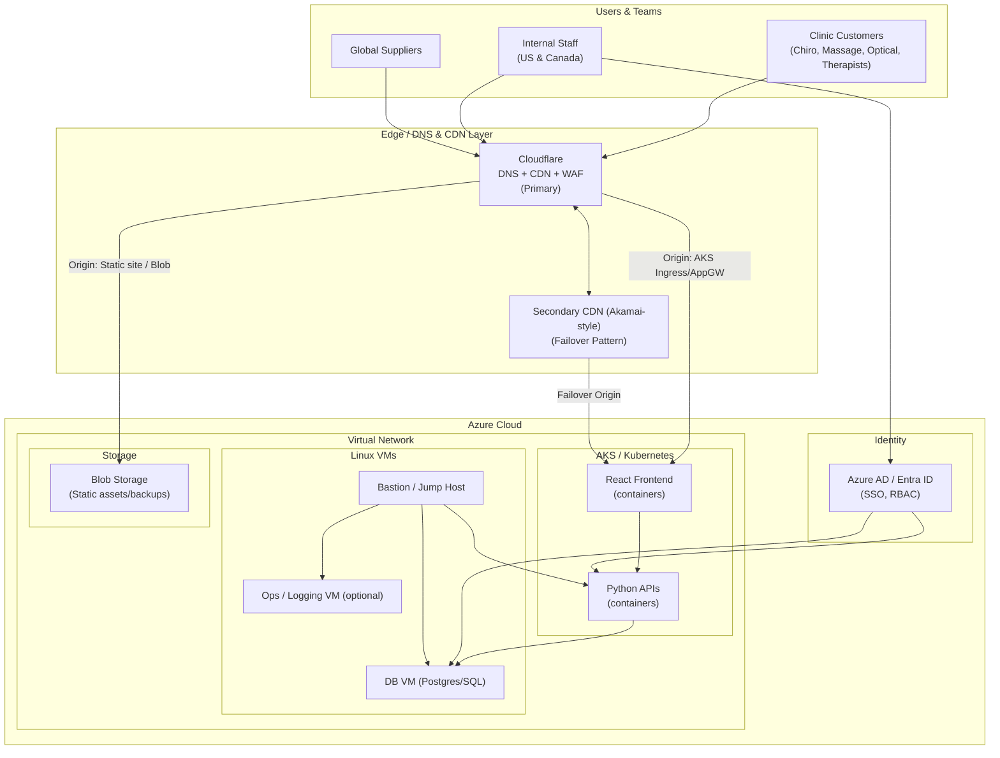

# Architecture Diagram – Lab 2.0

```mermaid
flowchart TB

  subgraph Users["Users & Teams"]
    U1["Clinic Customers<br/>(Chiro, Massage, Optical, Therapists)"]
    U2["Internal Staff<br/>(US & Canada)"]
    U3["Global Suppliers"]
  end

  subgraph DNSCDN["Edge / DNS & CDN Layer"]
    CF["Cloudflare<br/>DNS + CDN + WAF<br/>(Primary)"]
    AK["Secondary CDN (Akamai-style)<br/>(Failover Pattern)"]
  end

  subgraph Azure["Azure Cloud"]
    subgraph Identity["Identity"]
      AD["Azure AD / Entra ID<br/>(SSO, RBAC)"]
    end

    subgraph Net["Virtual Network"]
      subgraph K8s["AKS / Kubernetes"]
        AKSFE["React Frontend<br/>(containers)"]
        AKSAPI["Python APIs<br/>(containers)"]
      end

      subgraph VMs["Linux VMs"]
        DBVM["DB VM (Postgres/SQL)"]
        BAST["Bastion / Jump Host"]
        OPS["Ops / Logging VM (optional)"]
      end

      subgraph Storage["Storage"]
        BLOB["Blob Storage<br/>(Static assets/backups)"]
      end
    end
  end

  U1 --> CF
  U2 --> CF
  U3 --> CF

  CF <---> AK

  CF -->|"Origin: AKS Ingress/AppGW"| AKSFE
  CF -->|"Origin: Static site / Blob"| BLOB

  AK -->|"Failover Origin"| AKSFE

  AKSFE --> AKSAPI
  AKSAPI --> DBVM

  U2 --> AD
  AD --> AKSAPI
  AD --> DBVM

  BAST --> DBVM
  BAST --> AKSAPI
  BAST --> OPS
```
This diagram represents the target architecture for the lab.
As the project evolves, I will update this with alternate renderings.
